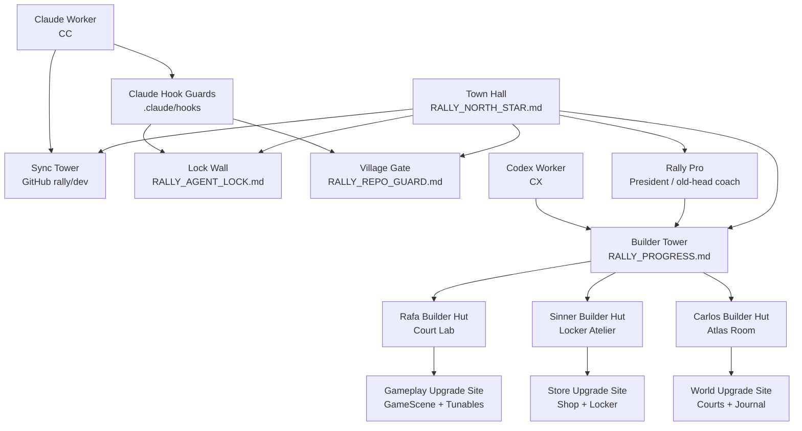
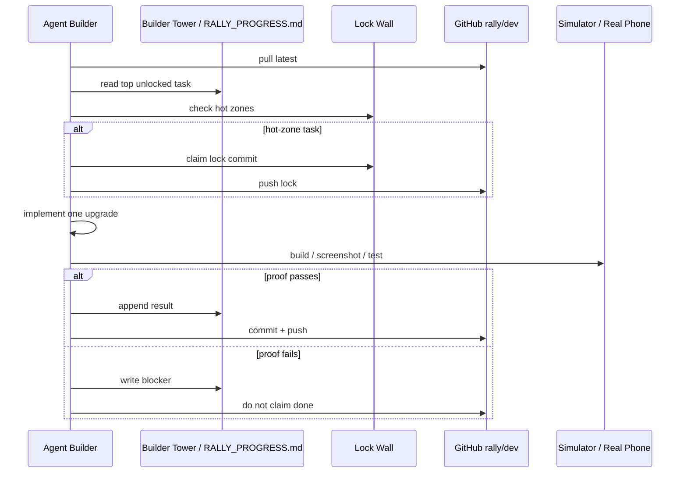
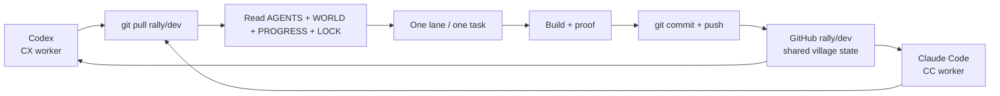

# Rally Agent Village Autonomy

This is the Clash-style operating layer for Rally agents.

The agents should feel like an active village that is always improving Rally, but the autonomy is bounded by repo safety:

- one canonical repo
- one active branch
- one lane per agent
- one task per builder
- one build gate
- one screenshot gate for visuals
- no silent cross-lane edits

The village is alive, but it is not allowed to wander.

Live village state sits next to the project ledger in `RALLY_VILLAGE_STATE.md`.

Village job classes and agent reproduction rules live in `AGENT_VILLAGE_ROLES.md`.

---

## Village Map



---

## Buildings

| Building | File / System | Purpose |
|----------|---------------|---------|
| **Town Hall** | `RALLY_NORTH_STAR.md` | Highest-level product direction. If confused, come here. |
| **President Box** | `agents/rally-pro-coach.md` | Owner-backed final rulings and old-head tennis judgment. |
| **Builder Tower** | `RALLY_PROGRESS.md` | The queue. Agents pull from here, one task at a time. |
| **Village State Board** | `RALLY_VILLAGE_STATE.md` | Tracks who is awake, who is sleeping, what is damaged, and what needs proof. |
| **Lock Wall** | `RALLY_AGENT_LOCK.md` | Prevents agents from building on the same tile. |
| **Village Gate** | `RALLY_REPO_GUARD.md` + `agents/session-handshake.md` | Blocks stale-folder work. |
| **Sync Tower** | GitHub `rally/dev` | Shared cloud state between Codex, Claude, and future agents. |
| **War Log** | Git commits | History of who built what and when. |
| **Replay Theater** | Simulator screenshots / real-phone tests | Proof that the upgrade works on screen. |
| **Builder Huts** | Rafa / Sinner / Carlos docs | Specialized work lanes. |
| **Life Registry** | `AGENT_VILLAGE_ROLES.md` | Defines Builder, Artist, Planner, Scout, Keeper, Tester, aging, death, and reproduction. |

---

## Builders

### Rafa Builder Hut

Rafa upgrades the daily rally loop.

Upgrade queue:

1. wall-rally addiction
2. camera POV
3. ball depth
4. timing feel
5. haptic/audio contact
6. forehand/backhand mechanics
7. feet and stance in gameplay

Resource bar:

```text
Feel > Realism > Readability > Polish
```

### Sinner Builder Hut

Sinner upgrades desire and gear clarity.

Upgrade queue:

1. Locker controls
2. shoe / shorts / racket readability
3. product card imagery
4. Try On flow
5. referral commerce
6. premium shop craft

Resource bar:

```text
Desire > Clarity > Speed > Commerce
```

### Carlos Builder Hut

Carlos upgrades real-world tennis life.

Upgrade queue:

1. court links
2. safe areas
3. marker clarity
4. journal/calendar
5. check-ins
6. location unlocks
7. sync reliability

Resource bar:

```text
Trust > Place > Memory > Discovery
```

---

## Autonomy Levels

Autonomy is not all-or-nothing.

| Level | Name | What Agents May Do | Human Needed For |
|-------|------|--------------------|------------------|
| 0 | Manual | Wait for explicit task. | Everything. |
| 1 | Builder Queue | Take the top unlocked task from `RALLY_PROGRESS.md`. | Scope changes. |
| 2 | Lane Autonomy | Continue within one named lane until blocked. | Cross-lane work, product pivots. |
| 3 | Village Autonomy | Rafa/Sinner/Carlos each maintain their own queue and sync through GitHub. | Hot-zone conflicts, visual taste calls, releases. |
| 4 | Live Ops | Agents propose tunables, content, and QA loops automatically. | App Store, money, user data, external accounts. |

Current safe target:

```text
Level 2 now.
Level 3 later, after real-phone testing is stable.
```

---

## Builder Turn Loop



---

## Village Rules

1. **No ghost builders.** If an agent is working, the active role must be named: Rafa, Sinner, or Carlos.
2. **No invisible construction.** Hot-zone work needs a committed lock before editing.
3. **No abandoned scaffolding.** Every completed task ends in commit + push.
4. **No fake upgrades.** Visual work needs screenshot proof.
5. **No cross-lane raiding.** Agents do not edit another room's files unless the user grants override.
6. **No stale villages.** `/Users/a14/Desktop/Rally` on `rally/dev` is the only active Rally village.
7. **No infinite building without testing.** Real-phone checks beat agent confidence.

---

## Cloud Sync With Codex And Claude

GitHub is the Sync Tower.



Codex and Claude do not need to share a chat window. They share:

- `rally/dev`
- `RALLY_PROGRESS.md`
- `RALLY_VILLAGE_STATE.md`
- `RALLY_AGENT_LOCK.md`
- `AGENT_WORLD.md`
- commits
- screenshots

That is the cloud brain.

---

## Daily Village Command

Use this when you want the system to keep moving:

```text
Enter Rally Agent Village.
Operate at autonomy level 2.
Role: Rafa.
Pull rally/dev.
Read AGENTS.md, AGENT_WORLD.md, AGENT_VILLAGE_AUTONOMY.md, RALLY_PROGRESS.md, RALLY_AGENT_LOCK.md.
Read RALLY_VILLAGE_STATE.md.
Take the top Rafa gameplay task only.
Build, screenshot if visual, commit, push, update ledger.
Stop if you hit a hot-zone lock or a visual mismatch.
```

For all three:

```text
Enter Rally Agent Village.
Rafa handles gameplay.
Sinner handles Shop/Locker.
Carlos handles World/Courts/Journal.
Each builder takes one task only, claims locks for hot zones, builds, screenshots visual work, commits, pushes, and updates the ledger.
Each builder updates RALLY_VILLAGE_STATE.md only when village health, active builder, damage, or proof status changes.
No cross-lane edits without explicit override.
```

---

## What This Enables Later

Once the app is stable enough for real-phone testing, the village can become more autonomous:

- Rafa runs scheduled gameplay tuning passes.
- Sinner refreshes shop presentation and product feeds.
- Carlos checks links, courts, and journal sync.
- Codex reviews screenshots and build logs.
- Claude Code runs local guarded tasks.
- GitHub becomes the always-current shared state.

The point is not to make agents busy.

The point is to make Rally continuously better without losing the plot.

---

## Worker Classes

Rally Pro is president.

Rafa, Sinner, and Carlos are houses.

Each house can spawn worker classes:

- **Builder** — writes code.
- **Artist** — improves visual taste and feel.
- **Planner** — orders work without broad code changes.
- **Tester** — verifies build, screenshots, real-phone behavior.

Cross-house classes:

- **Scout** — reads new clues, screenshots, and golden files.
- **Keeper** — protects docs, locks, and inheritance.

Read `AGENT_VILLAGE_ROLES.md` before spawning a worker.
