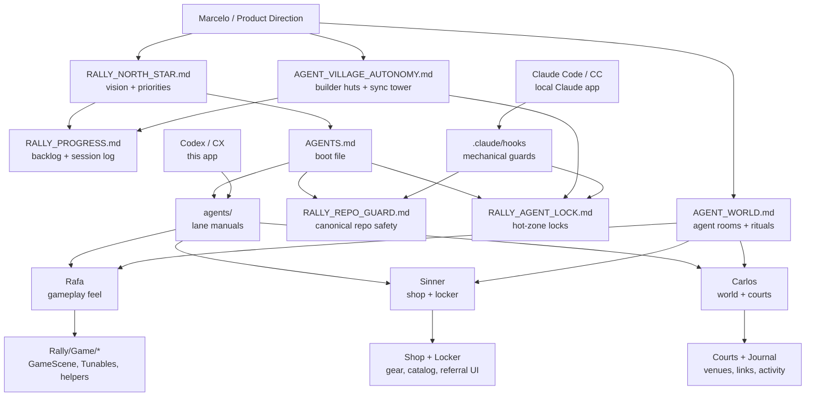
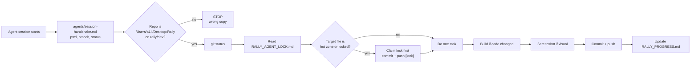
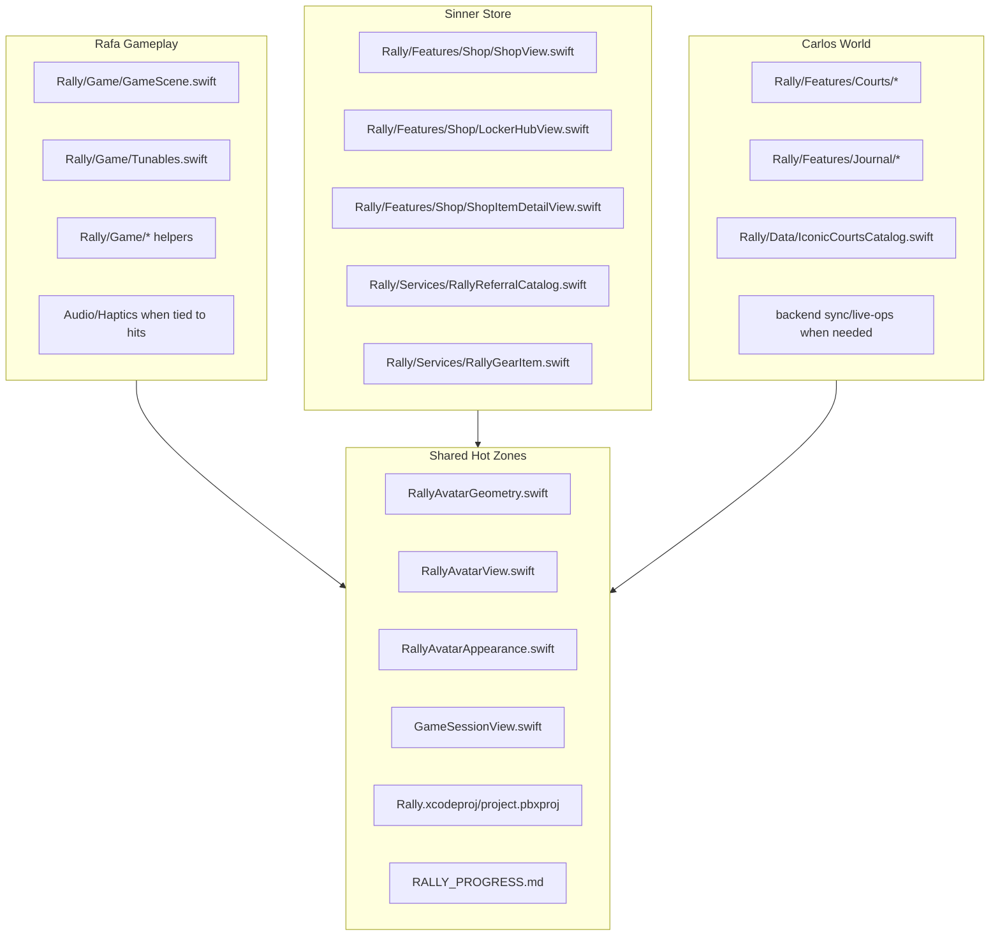
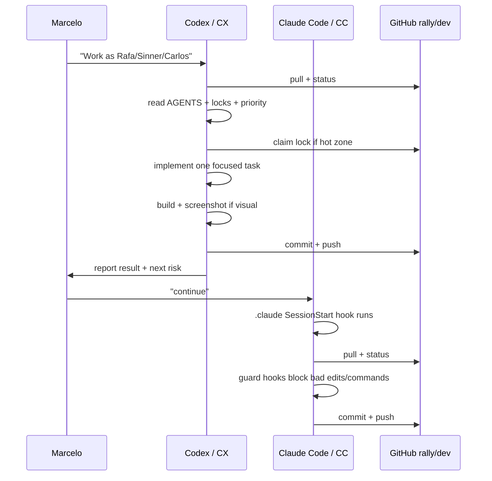

# Rally Agent Visualizer

This file is the map of who is working on Rally, what they own, what guards them, and how Claude Code and Codex should cooperate.

Use it when the project feels noisy. It is a visual index, not a replacement for the rules.

For the more immersive "little world" view of the agents, read `AGENT_WORLD.md`.

For the autonomous Clash-style builder village, read `AGENT_VILLAGE_AUTONOMY.md`.

Source of truth order still comes from `AGENTS.md`:

1. `RALLY_NORTH_STAR.md`
2. `RALLY_REPO_GUARD.md`
3. `RALLY_AGENT_LOCK.md`
4. `agents/*`
5. `CLAUDE_CODE_PARALLEL_PLAN.md`
6. `RALLY_OVERHAUL_DIRECTIVE.md`

---

## Current Operating Picture

---

## Agent Roster

| Name | Surface | Primary Mission | Primary Files | Must Not Do |
|------|---------|-----------------|---------------|-------------|
| **Rafa** | Gameplay | Make wall rally addictive, physical, readable, and fair. | `Rally/Game/GameScene.swift`, `Rally/Game/Tunables.swift`, `Rally/Game/*`, gameplay audio/haptics | Add visual clutter, break Home/gameplay avatar identity, edit Shop/World without explicit override |
| **Sinner** | Store / Locker | Make gear selection and real-merch browsing feel premium and easy. | `Rally/Features/Shop/*`, `Rally/Services/RallyGearItem.swift`, `Rally/Services/RallyReferralCatalog.swift`, `Rally/Services/RallyReferralLinkRouter.swift` | Touch gameplay tuning or courts logic |
| **Carlos** | World / Courts | Make venues, links, court unlocks, and training-life surfaces trustworthy. | `Rally/Features/Courts/*`, `Rally/Features/Journal/*`, `Rally/Data/IconicCourtsCatalog.swift` | Rename actions dishonestly, show dead links, pile markers over cards |
| **Codex / CX** | Execution lane | Fast repo edits, builds, simulator screenshots, visual craft passes. | Any lane after declaring the hat; normally Home, Avatar, Shop, docs | Ignore locks, overwrite uncommitted work, use stale repo copies |
| **Claude Code / CC** | Execution lane | Local-machine execution with hooks; historically gameplay/journal/courts. | Game, Journal, Courts, backend, audio/haptics | Cross into CX-only files unless user explicitly overrides |

Named agents are roles. Codex or Claude can wear a role, but the active role must be stated before editing.

---

## Safety Hooks And Guards

### Claude Code Hook Coverage

| Hook | File | What It Does |
|------|------|--------------|
| Session start | `.claude/hooks/session-start.sh` | Injects repo path, branch, last commit, dirty status, and lock reminders into Claude Code context. |
| Edit guard | `.claude/hooks/guard-edit.sh` | Blocks writes outside `/Users/a14/Desktop/Rally`; blocks Claude from editing unambiguous CX files without override. |
| Bash guard | `.claude/hooks/guard-bash.sh` | Blocks destructive git commands such as `git reset --hard`, `git checkout -- .`, and `git clean -fd`. |

Codex does not automatically execute Claude hooks. For Codex, the protection is the markdown protocol plus the assistant obeying it.

---

## File Ownership Map

Hot zones require extra caution. If the file is in the hot-zone box, read `RALLY_AGENT_LOCK.md` before editing.

---

## Collaboration Contract

Rules:

- One agent takes one task at a time.
- One commit should represent one coherent change.
- Visual claims need screenshots.
- Gameplay claims need simulator or real-phone confirmation.
- If Home avatar and gameplay avatar diverge, stop polishing and fix identity first.

---

## Current High-Level Priority

As of the current docs, Rally is in **Rafa Gameplay mode**.

Focus:

1. Make wall rally addictive and readable.
2. Preserve avatar identity between Home and gameplay.
3. Build and test on a real iPhone.
4. Do not start large new Shop, World, or Journal features until the gameplay loop feels good.

Protected active edits are listed in `agents/current-priority.md`.
